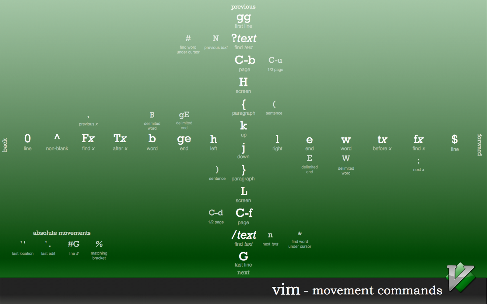
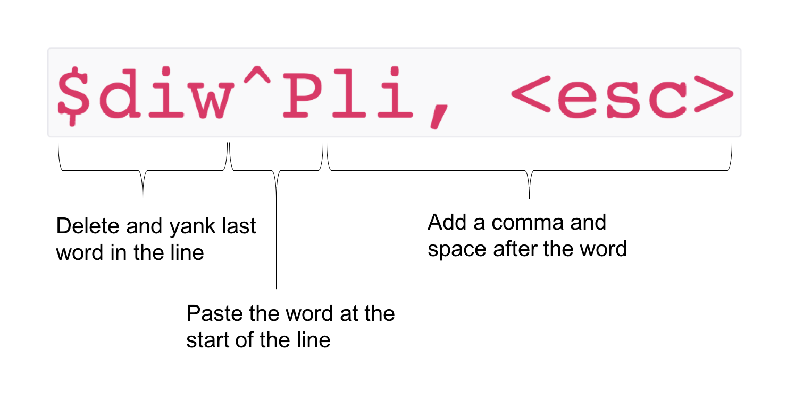
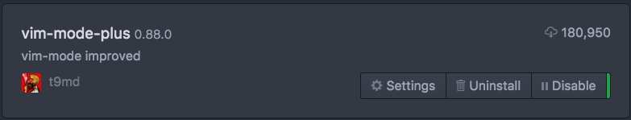

class: middle, center

# Speaking the Language of Vim

#### By Nick Waywood

---
## Contents

.flex[
.flex-1[
- Introduction

- Modal editor

- <b>The language</b>

- Other Vim features

    - dot command, macros

- Plugins

- How I use Vim 🎁

- Conclusion

- Resources
]
.flex-1[

]
]

---
## Introduction

- Vi - 1976

- VIM (Vi IMproved) - 1991

- Command line text editor (or GUI)

	- Runs everywhere

- Support for many programming languages (via Plugins)

- Extremely customisable

- Scriptable

- Built with a focus to edit existing documents

- **Modal Editor**

---
class: middle, center

## Modal Editor

---
## Modal Editing

.footnote[<su>* </su> Ex mode won't be covered in this talk]

<b>Change the meaning of the keys in each mode of operation</b>

- Normal mode - Navigate the structure of the file

- Insert mode - Editing the file

- Visual mode - highlight portions of the file to manipulate at once

- Ex mode - command mode <su>* </su>

--

As the name suggests, the majority of the time you should be in normal mode

---
## Normal Mode

- **Don't** use the mouse

- **Don't** use the arrow keys
--

- Instead:

    - Use normal mode to navigate the structure of the file

    - Use normal mode to specify what to edit

    - Be lazy! Your hands never need to leave the home row!

---
## Normal Mode - Basic Navigation

- `hjkl` - left down up right

--

- `^e`, `^y` - scroll the window down/up

- `^d`, `^u` - scroll down/up half a page

- `^f`, `^b` - scroll forward/back a full page

--

- `^` - move to first non blank character in line

- `$` - move to end of line (EOL)

--

- `gg` - go to top of file

- `G` - go to bottom of file

--

Note the frequent use of mnemonics

---
class: middle, center

## The Language
#### Motions, Text Objects and Operators

---
## Motions

.footnote[
<su>* </su>Motions can take numbers as modifiers
]

A motion is a movement from the current cursor position (start) to a defined target (end)<su>* </su>

- `w`, `e` - start/end of the next word

- `b` - the previous word

- `{`, `}` - start/end of a paragraph (code block)

- `tx`, `Tx` - find character 'til x forwards/backwards

- `fx`, `Fx` - find character x forwards/backwards

- `/regex` - search for `regex` within file

--

`hjkl`, `^`, `$`, `gg` and `G` from navigation slide are also motions (the others don't move the cursor)

---
## Motions

.hero-text[

]

---
## Text Objects

A text object defines a target <b>range</b> (start and end position). `i` and `a` are modifiers that slightly modify
the text object range

.flex-center[
.flex-item[]
.flex-item[
`i` - in/inside
]
.spacer[]
.flex-item[
`a` - all/around
]
.flex-item[]
]

- `iw`, `aw` - in word, around word

- `ip`, `ap` - in paragraph, around paragraph

- `it`, `at` - in tag, around tag

- `i)`, `a)` - inside parenthesis, around parenthesis (also `'`, `"`, `]` etc)

.footnote[
Text Objects can ONLY be used with the modifiers `i` and `a`
]

---
## Operators

An operator is a verb that specifies what action is to be taken on a specific target (motion or text object)

- `d` - delete (aka cut)

- `c` - change (delete, then place in insert mode)

- `y` - yank (copy)

- `v` - visually select (enters visual mode)

---
## All Together Now!
.flex.big[
`{operator} {motion or text object}`
]

Examples:

- `diw` - delete in word

- `ciw` - change in word

- `yi"` - yank in quotes

- `va)` - visually select around brackets

---
## All Together Now!

.flex[
.flex-1[
### Operators
- `d` - delete

- `c` - change

- `y` - yank

- `v` - visually select
]

.flex-1[
### Text Objects and Motions
- `$` - EOL (`C`, `D` and `Y` shortcuts)

- `G` - EOF

- `iw`, `aw` - word

- `ip`, `ap` - paragraph (code block)

- `it`, `at` - tag

- `i)`, `a)` - parenthesis
]
]

Every operator works with every text object and motion, commands are <b>composable</b>!

---
## The Core Idea - Speaking the Language

The core idea behind editing in Vim is continuously telling Vim "Do what to which target"

- "Do what" is expressed by an Operator

- "which target" is expressed by Motion or Text Object

--
name: core-idea

- Example:

.flex-center[
.flex-item.big[
`ciw`
]
.flex-item[
Do what (change) to which target (in word)
]
]

---
## The Language is Extensible!

Some third party Operators and Text Objects that I use all the time

.flex[
.flex-1[
### Operators
- `gc` - go comment

- `ys` - 'you' surround

- `cs` - change surrounding

- `ds` - delete surrounding

- `co` - change occurence <su>* </su>
]

.flex-1[
### Text Objects
- `ie`, `ae` - entire buffer

- `if`, `af` - function

- `il`, `al` - line

- `ic`, `ac` - comment
]
]

.footnote[
<su>* Not currently available as operator in vanilla Vim</su>
]

---
## Language Overview

.flex.big[
`{operator} {[number] motion or text object}`
]

.flex[
.flex-1[
### Operators
- `d` - delete
- `c` - change
- `y` - yank
- `v` - vis select
- `gc` - go comment
- `ys` -  add sur
- `cs` - change sur
- `ds` - delete sur
- `co` - change occ
]

.flex-1[
### Motions
- `hjkl` - navigation
- `w`, `e` - word forward
- `b` - word back
- `^`, `$` - start/end line
- `{`, `}` - paragraph
- `tx`, `Tx` - 'til char
- `fx`, `Fx` - find char
- `/regex` - regex
- `gg`, `G` - top/bot file
]
.flex-1[
### Text Object
- `iw`, `aw` - word
- `ip`, `ap` - paragraph
- `it`, `at` - tag
- `i)`, `a)` - parenthesis
- `i"`, `a"` - quotes
- `i}`, `a}` - braces
- `if`, `af` - function
- `il`, `al` - line
- `ic`, `ac` - comment
- `ie`, `ae` - file
]
]

9 Operators x (18 motions + 2 x 10 Text Objects) = <b>342 commands<su>* </su></b>

---
## Visual Mode - The Escape Hatch

- I view Visual mode as the escape hatch to use when your desired target can't be expressed with a Motion or Text Object

- Visual mode allows a 'free-form' target selection where the target is selected before the operator

- Use Text Objects whenever possible, then Motions, and visual mode as a last resort

.flex-center[
.spacer[]

]

--

- Example: Copy entire file

--

    - Visual: `ggvG$y` (or `ggVGy`), Motion: `ggyG`, Text Object: `yie`

--

See "The stages of learning Vim" resource for more information

---
## Misc commands

- `i` - enter insert mode

- `<esc>` - enter normal mode

- `p`/`P` - paste the contents of default register (clipboard) before/after cursor

- `dd`/`yy` - delete/yank the current line

--

More advanced commands to enter insert mode:

- `a` - append - enter insert mode to right of cursor

- `I`/`A` - Enter insert mode at start/end of line

- `o`/`O` - Enter insert mode on new line below/above current line

---
class: middle, center
## Other features
#### Language related features

---
## Dot Command and Macros

- The dot command (`.`) lets you repeat your last executed command

    - "Do the last thing that I said to you again"

    - However not everything is repeatable with the dot command

--

- Macros can store an arbitary number of commands to be run in sequence

    - Start recording macro: `q{register}`

    - Stop recording macro: `q`

    - Play macro: `@{register}`

    - Repeat last macro: `@@`

---
## Macro

.hero-text[
`$diw^Pli, <esc>`
]

--

- The delete operator both deletes the target text AND yanks it to buffer (just like 'cut' in other software)

---
## Macro

.hero-text[

]

---
## Plugins

- "I can't use Vim, I would miss &lt;insert IDE feature here&gt;!"

    - Vim has plugins for everything your heart desires

    - vimawesome.com

---
## Plugins

- `vim-plug` - Plugin manager

- `nerdtree` - file drawer

- `ctrlp` - fuzzy file finder

- `fugitive` - git tool

- `tagbar` - file symbol overview

---
class: middle, center
## How I Use Vim

---
## I Use Atom

.hero-text[

]

---
class: center, middle

---
## Atom

- Atom has a FANTASTIC Vim plugin called `vim-mode-plus`

    - Supports the vast majority of Vim

    - Lots of common third party Operators and Text Objects included by default

    - `co` and `go` operators

    - Easier to customise if you are not a VimScript expert (add keymaps etc)

    - Get the benefits of Vim as well as the benefits of a GUI editor

    - Mature, being actively developed

.flex-center[

]

---
## Other options

- If you don't want to use Vim or Atom, most editors have a Vim plugin (with varying quality!)

--

    - VSCode (Vim by vscodevim)- Good Vim emulation (a little immature but being actively developed)

--
    - Jetbrains IDEs (IdeaVim) - Personally never used but heard its very good (mature, not very active)

--
    - Emacs (evil mode) - Good Vim emulation (mature, somewhat active)

--
    - Sublime (<b>[D]</b> Vintage, <b>[D]</b> Vintageous, <b>[$]</b> Six) - Half finished, no longer being developed (RIP Sublime)

.footnote[
- <b>[D]</b> = Deprecated project, <b>[$]</b> = Plugin cost $
- PSA: Stop using Sublime, Atom and VSCode are both better, newer, open source alternatives that are being actively developed by reputable companies (GitHub and Microsoft)
]

--
- Chrome (Vimium) - Chrome isn't a text editor, but once you fall in love with Vim binding, you'll want them everywhere!

---

## Conclusion

- Editing in Vim is speaking a language composed of operators, motions and text objects

.flex-center.big[
`{operator} {[number] motion or text object}`
]

--

- The language of Vim is terse but it is still easy to learn and remember because of the mnemonics

--

- The language is the heart of Vim and is the biggest differentiator between Vim and other editors

--

- You don't need to switch to Vim to take advantage of Vim's language, other editors have Vim emulation

---
## Resources

- vim + tmux - OMG (first 40 min) - https://www.youtube.com/watch?v=5r6yzFEXajQ

- Extensibility vs Composability - https://medium.com/@mkozlows/why-atom-cant-replace-vim-433852f4b4d1

- The stages of learning Vim - http://whileimautomaton.net/2008/11/vimm3/operator

--

- Motions - http://inside.github.io/vim-presentation/images/vim-move-shortcuts.png

- Cheat sheet
    - Old version - http://www.viemu.com/vi-vim-cheat-sheet.gif

    - New version - http://michael.peopleofhonoronly.com/vim/

--

- My dotfiles - https://github.com/nwaywood/dotfiles

---
class: middle, center
## Thankyou - Questions?

---
## Why I moved to Atom from Vim

.flex[
.flex-1[
#### What I like

- Realtime linting <su>* </su>

- Breakpoint debugging

- Easier customisation

- Easier theming

- Hackable with web technologies <su>* </su>

- 'Occurence' Operator and preset-target

- <b>Nice</b> git gutter info
]
.flex-1[
#### What I miss

- Macros

- Misc little things

    - Consistent window nav<su>* </su>

    - Terminal is Vim buffer
]
]

.footnote[
<su>* </su>Not possible in the other editor
]

---
## Things I have Vim-ified

- Vim

- Atom

- Chrome

- tmux

- zsh (or bash)

--

- Quiver

- OSX App Switcher (Contexts)
